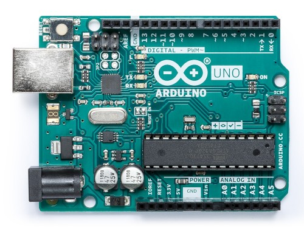
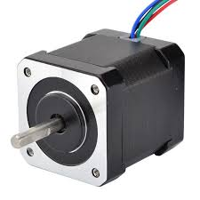

# 📍 Система управления шаговыми двигателями листогибочного станка: Описание и документация
### Перечень оборудования которое было использовано
1. [***Arduino Uno***(ATmega)](https://arduino.ru/Hardware/ArduinoBoardUno)

  
Показать изображение

  

2. [3 Шаговых двигателя ***Nema 17, 48mm, 42BYGH***](https://aliexpress.ru/item/32572890101.html?sku_id=12000045321628203&spm=a2g2w.productlist.search_results.0.2ea22371Z6YOiB)

  
Показать изображение

  

3. [3 Драйвера для ***ШД DM542***](https://aliexpress.ru/item/1005005264850020.html?sku_id=12000032911624793&spm=a2g2w.productlist.search_results.2.fa701b2bq0H6ed)

  
Показать изображение

  

___
## ℹ️ Описание

>Этот файл был синхронизирован с Obsidian
>[Инструкция как сделать также](https://habr.com/ru/articles/843288/)
