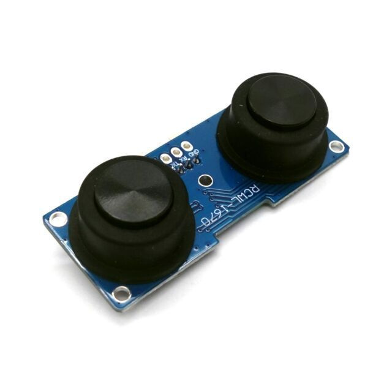

# 📍 Система управления шаговыми двигателями листогибочного станка: Описание и документация
### Перечень оборудования которое было использовано
1. [***Arduino Uno***(ATmega)](https://arduino.ru/Hardware/ArduinoBoardUno)

  
Показать изображение

  

2. [3 Шаговых двигателя ***Nema 17, 48mm, 42BYGH***](https://aliexpress.ru/item/32572890101.html?sku_id=12000045321628203&spm=a2g2w.productlist.search_results.0.2ea22371Z6YOiB)

  
Показать изображение

  

3. [3 Драйвера для ***ШД DM542***](https://aliexpress.ru/item/1005005264850020.html?sku_id=12000032911624793&spm=a2g2w.productlist.search_results.2.fa701b2bq0H6ed)

  
Показать изображение

  

4. [Ультразвуковой датчик ***RCWL-1670***](https://amperkot.ru/msk/catalog/datchik_urovnya_vodyi_rcwl1670_ultrazvukovoy_335v_15_mka-40125591.html?srsltid=AfmBOop5HNY47JB7gNTX6L6XEZXqf481btrm2yCJ1y2oIrMoWw0PExUi)

  
Показать изображение

  

 

## ℹ️ Описание
В современном производстве автоматизация играет ключевую роль в повышении эффективности и снижении затрат. Разработка системы управления шаговыми двигателями для листогибочного станка представляет собой актуальную задачу, направленную на автоматизацию процесса гибки листового металла, повышение точности и скорости операций, а также снижение влияния человеческого фактора. Внедрение такой системы позволит предприятиям оптимизировать производственный цикл и повысить конкурентоспособность.

 

## ⚙️Основные задачи
1. Подключение нескольких шаговых двигателей
2. Подключение датчика
3. Проектирование структурной схемы подключения
4. Сборка и подключение всех элементов
5. Тестирование готового стенда

 

## 🔞Подключение и запуск оборудования
### Нам понадобится
1. Компьютер
2. Провода для подключения
3. Макетная плата
4. Паяльная станция(Опционально)
### Подключение
1. Подключение Arduino UNO
   1. Для подключения Arduino UNO к компьютеру нужен кабель Тип A - USB 2.0 Тип B. На компьютер нужно установить Arduino IDE.

2. Подключение Ультразвукового датчика RCWL-1670
   1. Датчик имеет 4 выхода VCC ECHO TRIG GND. 
   2. VCC подключаем к 5V Arduino. 
   3. GND подключаем к GND на макетную плату, землю на макетную плату подводим с порта GND на Arduino. 
   4. Порты ECHO и TRIG втыкаем в любые 2 цифровых порта на Arduino 2-13, например 2 и 3.

3. Подключение Драйвера DM542 к Arduino Uno
   1. 

>Этот файл был синхронизирован с Obsidian
>[Инструкция как сделать также](https://habr.com/ru/articles/843288/)
